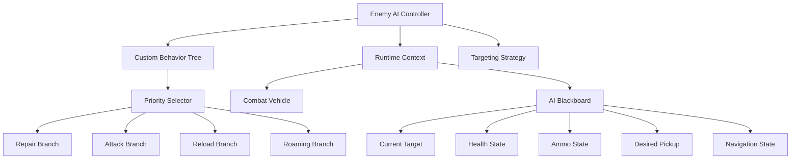
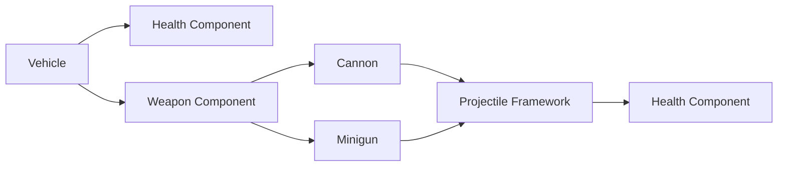

# DeathSentence

**Systems-Driven Vehicular Combat Prototype | Unreal Engine 5.6 | C++**

DeathSentence is a C++ vehicular-combat prototype built in Unreal Engine 5.6, focused on **gameplay systems architecture, autonomous combat AI, procedural arena generation, physics-based vehicle behavior, and modular combat systems**.

Rather than relying entirely on Unreal Engine's built-in gameplay solutions, this project implements several core systems from the ground up—including a **custom runtime Behavior Tree framework** used by combat vehicles to evaluate threats, manage resources, recover health and ammunition, engage targets, strafe during combat, and roam autonomously.

The project was designed as an exploration of how gameplay systems can remain **modular, extensible, debuggable, and independent from individual actors**.

---

## Technical Highlights

| System                   | Implementation                                                          | Engineering Focus                       |
| ------------------------ | ----------------------------------------------------------------------- | --------------------------------------- |
| **Custom Behavior Tree** | C++ node hierarchy with Selector, Sequence, Decorator and Task nodes    | AI architecture, Composite Pattern      |
| **Runtime AI Context**   | Shared controller / vehicle / blackboard execution context              | State separation, dependency management |
| **AI Blackboard**        | Runtime combat state including target, health, ammo and navigation data | Decoupled decision state                |
| **Target Selection**     | Pluggable scoring strategies                                            | Strategy Pattern                        |
| **Pickup Selection**     | Context-sensitive health/ammunition scoring                             | Utility-style decision making           |
| **Vehicle Combat AI**    | Target pursuit, range management, firing, strafing and roaming          | Autonomous movement                     |
| **Vehicle Recovery**     | Upside-down and stuck detection with safe recovery probing              | Physics robustness                      |
| **Combat Components**    | Reusable Health and Weapon actor components                             | Composition over inheritance            |
| **Projectile Framework** | Direct damage, splash damage, impulses and optional homing              | Extensible combat architecture          |
| **Procedural Arenas**    | Deterministic seeded grid-generation pipeline                           | Procedural generation                   |
| **Arena Archetypes**     | Swappable Maze Run / Crossfire generation strategies                    | Strategy Pattern                        |
| **Progression System**   | Enemy tracking, win/loss state and level transitions                    | Gameplay flow                           |

---

# Custom C++ Behavior Tree Framework

One of the primary technical goals of DeathSentence was to implement a **Behavior Tree runtime directly in C++** rather than making the AI logic dependent on Unreal Engine's Behavior Tree assets.

The framework is built around a common node interface:

```text
                    UDSBT_Node
                         │
            ┌────────────┴────────────┐
            │                         │
     Composite Nodes              Decorators
            │                         │
      ┌─────┴─────┐                  │
      │           │                  ▼
   Selector    Sequence             Child
      │
      └───────────────────┐
                          │
                       Tasks
```

Every node returns one of three execution states:

```cpp
Success
Failure
Running
```

This allows actions to persist across multiple frames rather than requiring every AI action to complete within a single update.

Examples include:

* driving toward a target
* navigating toward a pickup
* strafing around an enemy
* roaming through the arena

---

## Stateful Sequence Execution

Sequence nodes remember which child is currently executing.

```text
Sequence
   │
   ├── Find Target       ✓ Success
   │
   ├── Drive To Target   ⟳ Running
   │
   ├── Fire Weapon
   │
   └── Strafe
```

While `Drive To Target` returns `Running`, the sequence resumes that operation on subsequent ticks rather than restarting the entire branch.

Once a child fails, the sequence resets its execution state.

This provides a lightweight form of **multi-frame task execution** without requiring state to be manually coordinated by the AI Controller.

---

## Priority Selection and Branch Preemption

The Selector evaluates branches according to priority.

A particularly important feature is **running-child reset behavior**.

If another branch becomes valid while a previous branch is running, the previous branch is reset before execution switches.

For example:

```text
FRAME N

Attack
   └── Drive To Target    ← Running


Health drops below threshold


FRAME N+1

Repair                    ← Higher priority branch
   └── Find Health Pickup

Attack                    ← Reset
```

This gives the AI reactive behavior while preventing stale task state from leaking between branches.

---

# AI Decision Architecture

Each enemy vehicle owns an AI Controller responsible for coordinating several independent systems:



The architecture intentionally separates:

**Decision logic**

from

**gameplay state**

from

**vehicle execution**

so individual AI tasks don't need to own or duplicate global combat information.

---

# Runtime Blackboard

Enemy AI state is stored inside a dedicated blackboard object.

The blackboard tracks information such as:

```text
Self Vehicle
Current Target
Desired Pickup
Last Known Target Location
Wander Location
Normalized Health
Normalized Ammo
Target Visibility
Vehicle Orientation State
Current Debug Branch
```

The AI Controller continuously refreshes relevant values from gameplay components before evaluating the Behavior Tree.

This creates a clear data flow:

```text
Gameplay Components
        │
        ▼
    Blackboard
        │
        ▼
Behavior Tree
        │
        ▼
      Tasks
        │
        ▼
Vehicle / Weapons
```

As a result, AI decision logic remains largely independent of the concrete implementation of health, weapons and vehicle movement.

---

# Combat Behavior Tree

The runtime Behavior Tree is assembled programmatically when an AI Controller possesses a vehicle.

The current high-level tree is:

```text
ROOT SELECTOR
│
├── LOW HEALTH?
│      │
│      └── Repair Sequence
│             ├── Find Best Pickup
│             │      └── Repair Priority Strategy
│             │
│             └── Drive To Pickup
│
├── HAS AMMO?
│      │
│      └── Attack Sequence
│             ├── Find Target
│             ├── Drive To Target
│             ├── Fire Weapon
│             └── Strafe
│
├── LOW AMMO?
│      │
│      └── Reload Sequence
│             ├── Find Best Pickup
│             │      └── Reload Priority Strategy
│             │
│             └── Drive To Pickup
│
└── Roam
```

This lets the same vehicle transition naturally between **combat, survival, resource collection, and fallback exploration behavior**.

---

# Strategy-Based Target Selection

Target selection is separated from target discovery using the **Strategy Pattern**.

```cpp
UDS_TargettingStrategy
        │
        ├── Aggressive Targeting
        ├── Defensive Targeting
        └── Additional strategies...
```

The Behavior Tree task is responsible for discovering potential targets.

The strategy is responsible only for answering:

> How valuable is this target right now?

This separation means AI personalities can change without rewriting the Behavior Tree.

The aggressive targeting strategy, for example, prioritizes closer targets.

The target-selection task adds additional contextual weighting such as:

* prioritizing the player
* avoiding excessive target tunneling
* retaining an existing target for a configurable interval
* rejecting destroyed vehicles

Conceptually:

```text
Potential Target
       │
       ▼
Targeting Strategy
       │
       ▼
   Base Score
       │
       ├── Player Priority
       ├── Current Target Penalty
       └── Distance / Strategy Weight
       │
       ▼
   Final Score
```

The highest-scoring valid actor becomes the AI's current target.

---

# Context-Sensitive Pickup Selection

Pickup selection uses the same Strategy-oriented design.

Different AI needs use different utility calculations.

### Repair Priority

```text
Health Pickup
     ▲
     │ High Priority
     │
Current AI State
     │
     ▼
Ammo Pickup
```

### Reload Priority

```text
Ammo Pickup
     ▲
     │ High Priority
     │
Current AI State
     │
     ▼
Health Pickup
```

The AI therefore does not simply navigate to the nearest pickup.

It evaluates:

```text
Pickup Type Value
        +
Distance Value
        =
Utility Score
```

This makes resource selection depend on the **current tactical objective**.

---

# Autonomous Vehicle Movement

Vehicle AI controls the same underlying vehicle interface used by gameplay systems rather than teleporting or directly manipulating transforms.

The `DriveToTarget` task calculates steering using vector relationships between the vehicle and its target.

```text
Vehicle Forward
       │
       │      Target
       │       /
       │      /
       │     /
       └────●
```

The system uses:

```cpp
DotProduct
CrossProduct
Distance
Desired Combat Range
Turn Magnitude
```

to determine:

* steering direction
* throttle intensity
* approach slowdown
* braking behavior
* when combat range has been reached

Throttle is reduced during aggressive turns and while approaching the desired firing distance, producing more controlled pursuit behavior.

---

# Combat Strafing

Once positioned near an opponent, AI vehicles can transition from pursuit into a **strafing/orbit behavior**.

Rather than simply driving directly toward the player forever, the combat sequence can:

```text
Acquire Target
      ↓
Approach Target
      ↓
Reach Combat Range
      ↓
Fire
      ↓
Strafe / Orbit
      ↓
Re-evaluate
```

This produces more varied encounters and separates **approach movement** from **combat positioning**.

---

# Vehicle Recovery System

Physics-driven vehicles inevitably encounter unstable situations.

DeathSentence includes automatic recovery for both:

### Upside-Down Vehicles

Vehicle orientation is evaluated using its up vector:

```cpp
DotProduct(
    VehicleUpVector,
    WorldUpVector
)
```

If the vehicle remains inverted beyond a configurable delay, recovery begins.

### Stuck Vehicles

The system also detects situations where:

```text
Throttle is being applied
        +
Vehicle displacement remains very small
        +
Condition persists for a duration
        =
Vehicle considered stuck
```

Rather than blindly resetting the vehicle at its current location, the recovery system probes multiple nearby candidate positions.

```text
       ●
   ●   ●   ●
       CAR
   ●   ●   ●
       ●
```

Ground traces determine valid nearby reset locations before the vehicle is teleported upright.

Linear and angular physics velocity are then cleared to produce a stable recovery.

This makes the vehicle layer significantly more resilient to unpredictable physics interactions and procedurally generated geometry.

---

# Component-Based Combat Architecture

Core combat responsibilities are implemented through reusable Unreal Actor Components.



This keeps the vehicle class focused on vehicle behavior instead of becoming responsible for every gameplay feature.

---

# Health Component

`UDS_HealthComponent` encapsulates:

* maximum health
* current health
* damage
* healing
* normalized health state
* death notification
* health-change notification

Health events are exposed using delegates.

```text
Damage
   ↓
Health Component
   ↓
Current Health Changes
   │
   ├── OnHealthChanged
   │
   └── OnOwnerDeath
```

The vehicle listens for its own death event instead of requiring the health component to know how a car should be destroyed.

This keeps the component reusable and avoids tightly coupling health logic with vehicle logic.

---

# Weapon Component

The weapon system centralizes weapon behavior inside `UWeaponComponent`.

It currently handles multiple weapon types including:

* cannon
* minigun

The component manages:

```text
Ammo
Cooldowns
Muzzle lookup
Spawn transforms
Targeted firing
Projectile spawning
Audio
Debug visualization
Projectile velocity
```

Shared firing logic is routed through a common projectile-spawning path instead of duplicating the entire weapon pipeline for each weapon type.

Muzzle components can be located dynamically by name, while fallback spawn offsets allow weapons to continue functioning even without a dedicated muzzle component.

---

# Extensible Projectile Framework

`ADS_ProjectileBase` provides the common functionality used by projectile variants.

Supported features include:

```text
Direct Hit Damage
Splash Damage
Explosion Radius
Radial Physics Impulse
Optional Homing
Projectile Lifetime
Owner / Instigator Filtering
Debug Impact Visualization
```

Specialized projectiles such as cannon rounds and bullets build on top of this shared implementation.

The resulting structure is:

```text
ADS_ProjectileBase
        │
        ├── Cannon Projectile
        │
        └── Bullet Projectile
```

The base implementation deliberately separates:

```text
Collision Detection
      ↓
Direct Damage
      ↓
Explosion Effects
      ├── Radial Damage
      └── Radial Physics Impulse
```

making new projectile behavior easier to extend without duplicating fundamental combat code.

---

# Deterministic Procedural Arena Generation

DeathSentence also contains a custom **grid-based procedural arena generator**.

Arena generation is deterministic through `FRandomStream`.

```text
Level Configuration
       │
       ├── Seed
       ├── Width / Height
       ├── Enemy Count
       ├── Pickup Counts
       └── Arena Archetype
       │
       ▼
Seeded RNG
       │
       ▼
Grid Generation
       │
       ├── Main Structure Pass
       ├── Lane Pass
       ├── Cover Pass
       ├── Player Spawn Reservation
       ├── Enemy Spawn Reservation
       └── Risk / Reward Pickup Placement
       │
       ▼
Arena Materialization
```

Using deterministic seeds provides reproducible procedural layouts—particularly useful when debugging generated environments.

---

## Multi-Pass Generation

Generation is intentionally divided into multiple stages rather than attempting to place everything simultaneously.

```text
Build Grid
    ↓
Apply Main Structure
    ↓
Apply Traversal Lanes
    ↓
Apply Cover
    ↓
Reserve Player Spawns
    ↓
Reserve Enemy Spawns
    ↓
Place Pickups
    ↓
Materialize World
```

This allows individual generation concerns to remain isolated and makes arena rules easier to modify.

Spawn placement also performs clearance checks so critical actors are not created inside blocked, reserved, boundary, cover, or centerpiece cells.

---

# Strategy-Based Arena Archetypes

Arena layouts use another application of the **Strategy Pattern**.

```text
Arena Generator
      │
      ▼
Arena Archetype Strategy
      │
      ├── Maze Run
      │
      └── Crossfire
```

Each archetype controls three generation stages:

```cpp
ApplyMainStructure()
ApplyLanePass()
ApplyCoverPass()
```

The generator therefore controls **how an arena is generated**, while each strategy controls **what style of arena should be generated**.

This avoids growing the generator into a large collection of archetype-specific conditionals.

Adding another layout style can be approached by implementing another arena strategy rather than rewriting the generation pipeline.

---

# Level-Driven Procedural Configuration

The Arena Director builds generation parameters from the current level.

As progression increases, configuration can change values such as:

```text
Arena Dimensions
Enemy Count
Health Pickups
Ammo Pickups
Boost Pickups
Weapon Pickups
Arena Archetype
Random Seed
```

The system can therefore increase gameplay complexity while continuing to use the same generation architecture.

---

# Gameplay Progression

`ADS_ProgressionGameMode` coordinates match state.

It monitors:

```text
Player Alive?
      │
      ├── No  → Restart Level
      │
      └── Yes
            │
            ▼
      Enemies Remaining?
            │
            ├── Yes → Continue
            │
            └── No  → Next Level
```

Transitions are queued with timers rather than happening immediately when the final combat event occurs.

This keeps round resolution separate from vehicle and AI code.

---

# Debugging and Development Visibility

The project contains runtime debugging hooks throughout major systems.

Examples include:

* current AI Behavior Tree branch
* active targeting strategy
* normalized health
* normalized ammunition
* desired combat range
* projectile spawn visualization
* projectile impact visualization
* enemy-count diagnostics
* invalid configuration warnings

This was useful while developing stateful AI because behavior can otherwise be difficult to diagnose from vehicle movement alone.

A useful AI diagnostic string exposes information in the form:

```text
AI Controller
│
├── Strategy
├── Active Branch
├── Health
├── Ammo
└── Desired Range
```

The goal was to make the reasoning behind AI actions visible during runtime instead of debugging autonomous behavior as a black box.

---

# Design Patterns Used

The project intentionally applies several common gameplay-programming patterns.

### Composite Pattern

Used by the custom Behavior Tree.

```text
Node
├── Composite
│   ├── Selector
│   └── Sequence
├── Decorator
└── Task
```

### Strategy Pattern

Used for:

```text
Target Selection
Pickup Selection
Arena Generation
```

Behavior can therefore change without changing the caller.

### Component Pattern

Used for reusable gameplay capabilities:

```text
Vehicle
├── Health Component
└── Weapon Component
```

### Event-Driven Communication

Health changes and death events use delegates so consumers can respond without the health component knowing their implementation.

### Runtime Context / Blackboard

Shared AI execution state is moved outside individual tasks, reducing duplicated state and coupling between Behavior Tree nodes.

---

# Source Structure

```text
Source/DeathSentence/
│
├── NishantCodeBase/
│   │
│   ├── Components/
│   │   ├── HealthComponent/
│   │   └── WeaponComponent/
│   │
│   ├── EnemyAI/
│   │   ├── BT/
│   │   │   ├── DSBT_Node
│   │   │   ├── DSBT_Tree
│   │   │   ├── DSBT_SelectorNode
│   │   │   ├── DSBT_SequenceNode
│   │   │   ├── DSBT_Decorator
│   │   │   └── DSBT_RuntimeContext
│   │   │
│   │   ├── BlackBoard/
│   │   ├── Controller/
│   │   ├── Decorators/
│   │   ├── Strategy/
│   │   └── Tasks/
│   │
│   ├── Game/
│   │   └── DS_ProgressionGameMode
│   │
│   ├── PCG/
│   │   ├── DS_ArenaDirector
│   │   ├── DS_ArenaGeneratorBase
│   │   ├── DS_ArenaArchetypeStrategy
│   │   ├── DS_ArenaMazeRun
│   │   ├── DS_ArenaCrossfire
│   │   ├── DS_GridTypes
│   │   └── DS_LevelConfig
│   │
│   ├── Pickups/
│   │   ├── DS_Pickup
│   │   ├── DS_HealthPickup
│   │   ├── DS_CannonPickup
│   │   └── DS_MinigunPickup
│   │
│   ├── Player/
│   │   └── DS_Car
│   │
│   └── Projectile/
│       ├── DS_ProjectileBase
│       ├── DS_CannonProjectile
│       └── DS_BulletProjectile
│
└── ...
```

---

# Behavior Tree Tasks

The custom AI currently contains gameplay-specific tasks including:

```text
FindTarget
DriveToTarget
FireWeapon
Strafe
Roam
FindBestPickup
DriveToPickup
```

Each task has a focused responsibility and communicates through the runtime context and blackboard rather than directly coordinating with sibling tasks.

This allows new behaviors to be composed from existing nodes.

For example:

```text
Find Target
+
Drive To Target
+
Fire
+
Strafe
=
Combat Behavior
```

while:

```text
Find Health Pickup
+
Drive To Pickup
=
Recovery Behavior
```

---

# Technology

* **Unreal Engine 5.6**
* **C++**
* **Chaos Vehicles**
* **Enhanced Input**
* **Unreal Physics**
* **UMG / Slate**
* **Navigation System**
* **Niagara**
* **Unreal UObject / Actor Component architecture**

---

# What This Project Demonstrates

DeathSentence was primarily an engineering-focused gameplay project.

The most important technical goals were:

* building an AI execution framework rather than treating AI as a collection of controller conditionals
* separating AI **state**, **decision making**, and **physical execution**
* implementing multi-frame Behavior Tree execution
* supporting reactive branch switching and task reset semantics
* exploring utility-based target and resource scoring
* creating reusable gameplay components
* designing an extensible projectile/combat framework
* handling failure cases inherent to physics-driven vehicles
* building deterministic procedural content generation
* using Strategy-based architecture to prevent large conditional systems
* creating runtime debugging tools for complex autonomous behavior

---

# Running the Project

### Requirements

* Unreal Engine **5.6**
* C++ development environment supported by Unreal Engine
* Chaos Vehicles plugin

### Setup

```bash
git clone https://github.com/WARL0RD-11/DeathSentence.git
```

Open:

```text
DeathSentence.uproject
```

with Unreal Engine 5.6 and compile the C++ project when prompted.

---

# License

This project is distributed under the **MIT License**.

See [`LICENSE`](LICENSE) for details.

---

## Author

**Nishant Verma**
Gameplay Programmer / Systems Programmer

Primary areas demonstrated in this project:

`C++` · `Unreal Engine` · `Gameplay Systems` · `AI Architecture` · `Behavior Trees` · `Strategy Pattern` · `Procedural Generation` · `Vehicle AI` · `Physics` · `Combat Systems`
